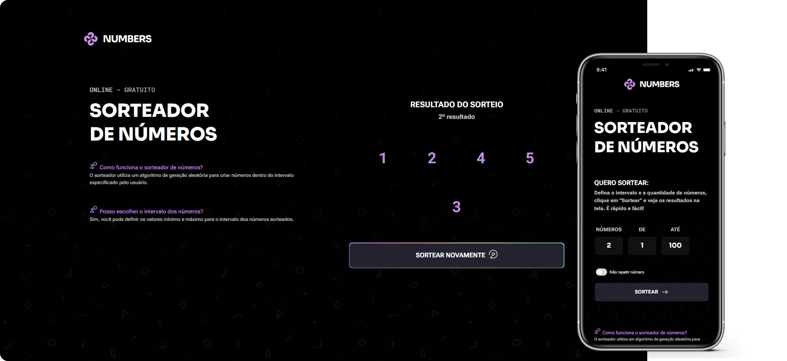

# Sorteador de Números

    

## Projeto
> Formação FullStack - Rocketseat

Este projeto é uma aplicação interativa de sorteio de números, que permite ao usuário escolher quantos números deseja sortear e definir um intervalo personalizado. Com um visual responsivo e animações, o aplicativo foi desenvolvido para colocar em prática conceitos intermediários de JavaScript, manipulação de DOM e animações CSS.

## ✨ Funcionalidades da Aplicação
- **Seleção da Quantidade de Números:** O usuário pode definir a quantidade de números que deseja sortear.
- **Definição do Intervalo:** É possível especificar um intervalo numérico personalizado entre dois valores.
- **Evitar Números Repetidos:** A opção de evitar números repetidos garante sorteios sem duplicatas.
- **Animação dos Resultados:** Os números sorteados aparecem de forma animada na tela, tornando a experiência mais atraente e dinâmica.
- **Responsividade:** A aplicação foi desenvolvida para se adaptar a diferentes tamanhos de tela.

### 📋 Detalhes da Implementação

#### Sorteio dos Números

1. O usuário define a quantidade de resultados desejada e o intervalo numérico (mínimo e máximo).
2. A aplicação então realiza o sorteio, usando um algoritmo de geração aleatória, e exibe cada número com animações.

#### Animações

1. Cada número sorteado é apresentado com uma animação, adicionando um toque visualmente dinâmico ao sorteio.
2. Os botões de sortear tem sua própria animação que inclui no hover um gradiente na borda.

#### Eventos e Funções

1. Eventos de clique disparam o sorteio e as animações.
2. Funções JavaScript geram números aleatórios, manipulam a exibição dos resultados e controlam o estado da interface (como a opção "Não repetir número").

## 🛠️ Tecnologias Utilizadas

- HTML
- CSS
- JavaScript
